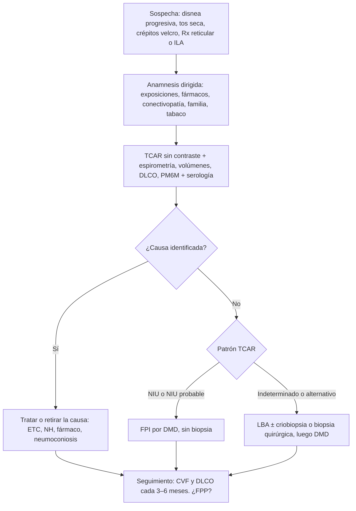

# EPID: enfermedades pulmonares intersticiales difusas

> [!info] Cómo usar esta nota
> Nota central del tema. Integra la sección de Coni (doc grupal) con mis apuntes satélite y las guías vigentes.
> Satélites: [[Pirfenidona]] · [[Nintedanib]] · [[Fibrosis pulmonar idiopática]] · [[Neumonitis por hipersensibilidad]] · [[Sarcoidosis]] · [[Neumoconiosis]] · [[Neumotoxicidad por fármacos]] · [[Hipertensión pulmonar]]
> Leyenda: 🔴 corregir · 🟠 actualizar · 🟢 agregar

---

## 1. Definición
- Más de 200 entidades que comprometen el **intersticio alveolar** (entre epitelio y endotelio), a menudo también alvéolos, vía aérea pequeña y vasos.
- Producen **inflamación, fibrosis o ambas**.
- Vía final común: **restricción** (↓ distensibilidad y volúmenes) + **trastorno de difusión** y desigualdad V/Q → hipoxemia que **empeora con el ejercicio**.

## 2. Clasificación

**ATS/ERS 2002 / 2013**

| Grupo | Entidades |
|---|---|
| Causa conocida o asociada | Conectivopatías (AR, ES, miopatías, Sjögren, LES, EMTC), fármacos, radiación, NH, neumoconiosis, vasculitis ANCA (MPO asociado a NIU) |
| NII fibrosantes crónicas | FPI (NIU), NINE |
| NII relacionadas con tabaco | BR-EPID, NID |
| NII agudas / subagudas | NOC, NIA |
| NII raras | NIL, FEPP, inclasificable |
| Granulomatosas | Sarcoidosis |
| Otras | LAM, histiocitosis de Langerhans, proteinosis alveolar, neumonías eosinofílicas |

> [!warning] 🔴 Nota grupal
> La EPID asociada a conectivopatía **no es "de causa desconocida"**: es causa conocida o asociada. Los porcentajes 35/65 no tienen fuente; no darlos como dato duro.

**Clasificación clínica (la que manda hoy)**

| Fibrótica | No fibrótica (inflamatoria) |
|---|---|
| FPI, NINE fibrótica, NH fibrótica, EPID-ETC fibrótica, neumoconiosis → peor pronóstico, **antifibróticos** si progresa | Sarcoidosis, NOC, NINE celular, NH no fibrótica → responden a corticoides e inmunosupresión |

- **ILA (anomalías intersticiales)**, Fleischner 2020: hallazgo incidental en TC que afecta > 5% de una zona pulmonar. Las subpleurales fibróticas progresan: hacer PFR y seguimiento.

## 3. Anamnesis y examen

**Exposiciones**
- Aves (mascotas, nidos en el entretecho), plumas (almohadas, cobertores), hongos y humedad, jacuzzi (*hot tub lung*, NH por *M. avium*), humo de leña, heno.
- Laborales: minería (sílice), construcción y astilleros (asbesto), metales, textil, agricultura.

**Fármacos**
- Por **neumotoxicidad**, no por tos 🔴: amiodarona, nitrofurantoína, MTX, bleomicina, busulfán, ciclofosfamida, **inhibidores de checkpoint**, ITK, anti-TNF, radioterapia. Ver [[Neumotoxicidad por fármacos]].

**Conectivopatía (red flags que sacan de FPI)**
- Raynaud, rigidez matinal, sicca, disfagia, manos de mecánico, debilidad proximal, rash, úlceras orales.

**Otros antecedentes**
- Familia: ≥ 2 casos → FPI familiar. Canas prematuras, citopenias o cirrosis → **telomeropatía** (tolera mal la inmunosupresión).
- Tabaco: la NH afecta más a no fumadores; HCL, BR-EPID y NID afectan a fumadores.

**Examen físico**
- **Crépitos tipo velcro** bibasales inspiratorios, que **no cambian con la tos**.
- Hipocratismo: FPI y asbestosis; raro en sarcoidosis y NH.
- Signos de HTP o cor pulmonale.

## 4. Algoritmo diagnóstico

**Laboratorio**
- Básico: hemograma, PCR/VHS, función renal y hepática, CK y aldolasa, orina.
- Autoinmune: **ANA, FR, anti-CCP, anti-Ro/La, anti-Scl-70, anticentrómero, anti-RNP**.
- Panel de miositis (**anti-Jo-1, PL-7, PL-12, anti-MDA5, anti-Ro52**), ANCA, IgG específicas o precipitinas (NH), BNP.
- Los biomarcadores séricos (KL-6, MMP-7, SP-D) **no se recomiendan** para diagnosticar FPI.

**Función pulmonar**

| Prueba | Hallazgo en EPID | Uso |
|---|---|---|
| Espirometría | CVF ↓, **VEF₁/CVF normal o ↑** | CVF = marcador de seguimiento (caída ≥ 5% relevante, ≥ 10% alto riesgo) |
| Volúmenes | **CPT < LIN confirma restricción** | Sin CPT no hay restricción confirmada |
| DLCO | ↓ (corregida por Hb) | La más sensible. DLCO muy baja con volúmenes normales → fibrosis + enfisema o HTP |
| PM6M | Desaturación ≥ 4% o nadir ≤ 88% | Pronóstico. Indicación de O₂ ambulatorio |
| GSA | Hipoxemia, hipocapnia, gradiente A-a ↑ | La hipercapnia es tardía |

> [!warning] 🔴 Nota grupal
> "Patrón restrictivo (CVF < 70%)" es **incorrecto**. La espirometría solo *sugiere* restricción: CVF < LIN con VEF₁/CVF normal o alta. **Se confirma con CPT < LIN.** El 0,70 es de VEF₁/CVF para *obstrucción*. ERS/ATS 2021: usar LIN o z-score (z < −1,645).

> [!tip] Trampa: fibrosis + enfisema combinados
> Volúmenes y CVF pseudonormales, pero **DLCO muy baja** y HTP frecuente. La caída de la CVF subestima la progresión.

**LBA**

| Hallazgo | Sugiere |
|---|---|
| Linfocitos > 30% (> 20% en NH fibrótica) | NH, sarcoidosis, NINE celular, NOC, fármacos |
| CD4/CD8 > 3,5 | Sarcoidosis |
| Eosinófilos > 25% | Neumonía eosinofílica, fármacos |
| Neutrófilos ↑ | FPI, NIA, infección, asbestosis |
| Líquido lechoso PAS+ | Proteinosis alveolar |
| Retorno cada vez más hemorrágico, hemosiderófagos > 20% | Hemorragia alveolar difusa |
| CD1a+ > 5% | Histiocitosis de Langerhans |
| Macrófagos espumosos | Amiodarona (exposición, no toxicidad) |

**Biopsia**
- **Criobiopsia transbronquial**: alternativa aceptada en centros con experiencia (2022). Neumotórax ~10%.
- **Biopsia quirúrgica (VATS)**: mortalidad electiva 1–2%. **Puede gatillar una exacerbación.**
- La biopsia transbronquial convencional no diagnostica NIU.

> [!warning] 🔴 Mi resumen 44
> "La biopsia se termina haciendo casi siempre" es falso. **NIU o NIU probable en TCAR + contexto compatible = FPI sin biopsia.**

## 5. TCAR

**Categorías de NIU (2018, ratificadas en 2022)**

| Categoría | Hallazgos | Conducta |
|---|---|---|
| **NIU** | **Panal** ± bronquiectasias de tracción, subpleural basal, heterogéneo | FPI sin biopsia |
| **NIU probable** | Reticulación + bronquiectasias de tracción periféricas, **sin panal** | 2022: equivale a NIU en el contexto clínico adecuado |
| **Indeterminado** | Fibrosis sutil o rasgos inespecíficos | LBA ± biopsia |
| **Alternativo** | Quistes, **mosaico o tres densidades**, vidrio esmerilado predominante, micronódulos, consolidación; distribución superior, peribroncovascular o con respeto subpleural | Otro diagnóstico |

> [!warning] 🟠 Nota FPI (Glasinovich)
> "Usual / posible / incompatible" es la clasificación de **2011**. Hoy son 4 categorías.

**Otros patrones**

| Patrón | Rasgo clave | Piensa en |
|---|---|---|
| NINE | Vidrio esmerilado + reticulación basal simétrica, **respeto subpleural** | ES, miopatía, NH, fármacos |
| Neumonía organizada | Consolidaciones periféricas migratorias, **halo invertido** | NOC, ETC, fármacos, post-infección |
| NH | Nódulos centrolobulillares + mosaico + atrapamiento aéreo, campos medios y superiores | NH |
| Sarcoidosis | Adenopatías hiliares bilaterales + nódulos **perilinfáticos**, lóbulos superiores | Sarcoidosis, silicosis |
| Quistes | Difusos en mujer (LAM) / con nódulos en fumador, lóbulos superiores (HCL) / escasos + Sjögren (NIL) | LAM, HCL, NIL |
| Empedrado (crazy paving) | Vidrio esmerilado + septos engrosados | Proteinosis, edema, hemorragia, *P. jirovecii* |

> [!warning] 🔴 Nota grupal: nódulos
> Separar por distribución:
> - **Perilinfático**: sarcoidosis, silicosis, linfangitis.
> - **Centrolobulillar**: NH, bronquiolitis respiratoria.
> - **Aleatorio (random)**: miliar, metástasis.

## 6. Fibrosis pulmonar idiopática → [[Fibrosis pulmonar idiopática]]

**Definición y pronóstico**
- NII fibrosante crónica progresiva, **limitada al pulmón**, con patrón NIU, en adultos, habitualmente > 60 años.
- Sobrevida mediana sin tratamiento 3–5 años; ~20% a 5 años.

**Factores de riesgo**
- Edad, hombre, tabaco (> 20 paquetes-año), polvos de metal o madera, RGE (asociación).
- Genética: promotor de **MUC5B**, telómeros (TERT, TERC, RTEL1, PARN), surfactante (SFTPC, SFTPA2).

**Patogenia**
- Microlesión epitelial repetida → **TGF-β** → miofibroblastos (**focos fibroblásticos**) → exceso de matriz.
- **No es inflamatoria**, por eso los corticoides no sirven.

**Índice GAP**

| | 0 | 1 | 2 | 3 |
|---|---|---|---|---|
| Género | M | H | | |
| Edad | ≤ 60 | 61–65 | > 65 | |
| CVF % | > 75 | 50–75 | < 50 | |
| DLCO % | > 55 | 36–55 | ≤ 35 | No puede realizarla |

Estadio I (0–3): mortalidad a 1 año ~6% · II (4–5): ~16% · III (6–8): ~39%

**Fenotipos (nota Glasinovich)**
- Progresor lento: CVF −130 a −210 mL/año.
- Progresor rápido (10–15%): caída de CVF > 10% o DLCO > 15% en 6–12 meses.
- Con exacerbaciones (5–20%).
- Fibrosis + enfisema combinados.

**Criterios de alto riesgo**
- DLCO ≤ 40%, SpO₂ ≤ 88% en PM6M, panal extenso, HTP.
- Caída de CVF ≥ 10% o de DLCO ≥ 15% en 6 meses.

**Comorbilidades**
- HTP (~8–15% al diagnóstico, 30–50% en enfermedad avanzada). 🔴 El "88%" de la nota no tiene sustento.
- Cáncer pulmonar ×5, RGE, apnea del sueño, enfermedad coronaria, TEP, depresión.

## 7. Antifibróticos → [[Pirfenidona]] · [[Nintedanib]]
Frenan la caída de la CVF en ~50%; **no revierten la fibrosis**. Se inician **al diagnóstico**, sin exigir CVF > 50% ni DLCO > 35% 🟠, y se mantienen también durante la exacerbación.

| | Pirfenidona | Nintedanib | Nerandomilast (nuevo) |
|---|---|---|---|
| Mecanismo | ↓ TGF-β y TNF-α, ↓ fibroblastos y colágeno | Inhibidor de tirosina quinasa de **PDGF, FGF y VEGF** | Inhibidor de **PDE4B** |
| Indicación | FPI (no en FPP: "investigar") | FPI, **FPP** (INBUILD), **ES-EPID** (SENSCIS) | FPI (FIBRONEER-IPF); FPP con datos positivos. FDA 2025, verificar Chile |
| Dosis | 267 → 534 → **801 mg c/8 h** (2.403 mg/día), con comida | **150 mg c/12 h**; **100 mg c/12 h** si hay intolerancia o Child A | 18 mg c/12 h |
| Efectos adversos | Náuseas, **fotosensibilidad**, ↑ transaminasas, baja de peso | **Diarrea ~60%**, ↑ transaminasas, sangrado, trombosis arterial, perforación GI | Diarrea, baja de peso |
| Pruebas hepáticas | **Mensual × 6 meses**, luego cada 3 meses | **Mensual × 3 meses**, luego cada 3 meses | Según ficha |
| Riñón | Sin ajuste con ClCr 30–80; **evitar si < 30 o en diálisis** | Sin ajuste leve-moderado | — |
| Hígado | **Contraindicado en Child C** | Child A: 100 mg; **evitar Child B-C** | — |
| Interacciones | CYP1A2: **fluvoxamina contraindicada**, ciprofloxacino → 1.602 mg/día, **tabaco ↓ 50%** | P-gp/CYP3A4: ketoconazol ↑; rifampicina, carbamazepina, fenitoína ↓; anticoagulación → sangrado | La pirfenidona baja sus niveles |
| Contraindicaciones | Child C, ClCr < 30, fluvoxamina | **Embarazo**, **alergia a maní o soya**, IAM o cirugía abdominal reciente | Embarazo |
| Ensayos | CAPACITY, **ASCEND** | **INPULSIS**, INBUILD, SENSCIS | FIBRONEER |

> [!warning] 🔴 Nota FPI (Glasinovich)
> - "Nintedanib: no hay que reducir la dosis" → **falso**, se baja a 100 mg c/12 h.
> - "Pirfenidona es un antibiótico" → es **antifibrótico**.
> - "Bajar la dosis en falla renal" → sin ajuste con ClCr 30–80; se evita con < 30.

> [!tip] ¿Cuál elegir?
> - Anticoagulado o con cardiopatía isquémica → pirfenidona.
> - Mucho sol o uso de fluvoxamina → nintedanib.
> - FPP no-FPI o ES-EPID → nintedanib.

### Lo que NO se da en FPI
| Fármaco | Por qué |
|---|---|
| Prednisona + azatioprina + NAC | **PANTHER-IPF 2012**: ↑ mortalidad (🟠 la nota dice 2011) |
| NAC sola | Sin beneficio |
| Warfarina como antifibrótico | ACE-IPF: ↑ mortalidad |
| Ambrisentán | ARTEMIS-IPF: daño |
| Riociguat en HTP por NII | RISE-IIP: ↑ mortalidad |
| Imatinib, bosentán, macitentán, sildenafil | Sin beneficio |
| Antiácidos o funduplicatura "para la fibrosis" | 2022: condicional en contra 🟠 |

## 8. Fibrosis pulmonar progresiva (FPP, 2022) 🟢
En una EPID **no-FPI** con fibrosis, **≥ 2 de 3 criterios en 1 año** sin otra explicación:
1. Empeoramiento de síntomas.
2. Caída absoluta de **CVF ≥ 5%** o de **DLCO ≥ 10%**.
3. Progresión radiológica (más bronquiectasias de tracción, reticulación o panal nuevos, pérdida de volumen).

Tratamiento: **nintedanib** (INBUILD), **sumado** a la terapia de base.

## 9. Exacerbación aguda de FPI (definición 2016) 🟢🟠
1. FPI previa o concurrente.
2. Empeoramiento de la disnea en **< 1 mes**.
3. **Vidrio esmerilado o consolidación bilateral nuevos** sobre la NIU.
4. No explicado por ICC ni sobrecarga de volumen.

Se clasifica en **gatillada** (infección, procedimiento, aspiración) o **idiopática**. La definición de 2007 exigía excluir infección.

**Factores predisponentes** (nota Glasinovich)
- RGE, obesidad, CVF baja.
- Biopsia o broncoscopía.
- VM con volumen o FiO₂ altos, balance positivo.

**Manejo**
- Descartar TEP e ICC (angio-TC, ecocardiograma o BNP).
- O₂ o cánula de alto flujo. VM solo como puente a trasplante.
- **Metilprednisolona 500–1000 mg/día × 3 días**, luego prednisona en descenso.
- Antibióticos empíricos. **Mantener el antifibrótico.** Tromboprofilaxis.
- **No ciclofosfamida** (EXAFIP 2020: ↑ mortalidad).

> [!danger] Mortalidad ~50% intrahospitalaria. Es la primera causa de muerte en FPI.

## 10. Manejo general y soporte
- **O₂ crónico** (ATS 2020): PaO₂ ≤ 55 o SpO₂ ≤ 88% en reposo (o PaO₂ 56–59 con cor pulmonale o Hto > 55%). Meta ≥ 90%. En EPID con desaturación grave al esfuerzo: **O₂ ambulatorio**.
- **Rehabilitación pulmonar.**
- **Vacunas** 🟠:
  - Influenza.
  - Neumococo: VNC20 o VNC21 en dosis única, o VNC15 + VPN23 (en Chile, calendario PNI).
  - COVID-19, **VRS** (≥ 60 años), herpes zóster recombinante, dTpa.
- **Tos**: morfina de liberación lenta 5 mg c/12 h (PACIFY 2023).
- **Paliativos** tempranos. Dejar de fumar.
- **HTP grupo 3** (PAPm > 20 mmHg, ESC/ERS 2022 🟠): **treprostinil inhalado** (INCREASE). Riociguat y ambrisentán contraindicados. Ver [[Hipertensión pulmonar]].

**Trasplante (ISHLT 2021)**
- **Derivar**:
  - NIU o NINE fibrótica **desde el diagnóstico**.
  - CVF < 80% o DLCO < 40%.
  - Caída de CVF ≥ 10%, DLCO ≥ 15%, o CVF ≥ 5% con síntomas en 2 años.
  - Requerimiento de O₂.
- **Enlistar**:
  - Caída de CVF ≥ 10% o de DLCO ≥ 10% en 6 meses.
  - SpO₂ < 88% o < 250 m en PM6M, o caída > 50 m en 6 meses.
  - HTP.
  - Hospitalización por exacerbación.

## 11. Neumonitis por hipersensibilidad (2020) → [[Neumonitis por hipersensibilidad]]
- Clasificación **no fibrótica / fibrótica**; reemplaza aguda, subaguda y crónica 🟠.
- TCAR: nódulos centrolobulillares + mosaico + **tres densidades**, campos medios y superiores, respeto relativo de las bases.
- LBA: linfocitos > 30% (> 20% en fibrótica).
- Precipitinas o IgG específicas = **exposición, no enfermedad**.
- En ~50% de las fibróticas no se identifica el antígeno (peor pronóstico).

**Tratamiento**
1. **Evitar el antígeno.**
2. No fibrótica sintomática: prednisona 0,5 mg/kg por 1–4 semanas, descenso en 4–8 semanas.
3. Fibrótica que progresa: prednisona + **MMF** 1–1,5 g c/12 h o azatioprina. Reevaluar a los 6 meses.
4. Si cumple FPP: nintedanib. Enfermedad terminal: trasplante.

> [!warning] 🔴 Nota NH
> "52% de oficinistas con pulmón del humidificador" no tiene sustento. Beclometasona inhalada: sin evidencia.

## 12. EPID en conectivopatías (ACR/CHEST 2023) 🟢
**Tamizaje con PFR + TCAR** (no con Rx) en ES, miopatías, EMTC, AR con factores de riesgo y Sjögren.

| Enfermedad | Patrón | Primera línea | Otras | Ojo |
|---|---|---|---|---|
| **Esclerosis sistémica** | NINE | **MMF, meta 3 g/día** | Tocilizumab 162 mg SC semanal, rituximab, CYC IV, nintedanib | **Prednisona ≥ 15 mg/día → crisis renal** |
| **AR** | **NIU** | MMF, rituximab | AZA, CYC, nintedanib | MTX **no** se suspende de rutina 🟠 |
| **Miopatías / antisintetasa** | NINE, NO | Corticoides + MMF | Tacrolimus, rituximab, IgIV, CYC | **Anti-MDA5**: EPID rápidamente progresiva → triple terapia |
| **Sjögren** | NINE, NIL | MMF | AZA, rituximab | Linfoma MALT |
| **LES** | Neumonitis aguda, hemorragia alveolar | MMF o AZA + corticoides | CYC, rituximab | TEP (antifosfolípidos) |

> [!note] Monitoreo de inmunosupresores
> - **MMF**: hemograma y pruebas hepáticas cada 2 semanas × 1 mes, mensual × 3 meses, luego cada 3 meses. **Teratógeno.**
> - **Azatioprina**: medir **TPMT** antes. **Alopurinol** → reducir la dosis al 25%.
> - **Ciclofosfamida**: cistitis hemorrágica (MESNA), mielosupresión, infertilidad.
> - **Rituximab**: tamizaje de VHB, hipogammaglobulinemia.
> - Con prednisona ≥ 20 mg > 4 semanas + inmunosupresión: **cotrimoxazol** (profilaxis de *P. jirovecii*), protección ósea, tamizaje de TBC latente y VHB/VHC/VIH.

## 13. Sarcoidosis → [[Sarcoidosis]]
**Diagnóstico**
- Clínica compatible + **granulomas no necrotizantes** (EBUS) + exclusión de TBC, hongos, linfoma y beriliosis.
- **Löfgren** (eritema nodoso + adenopatías hiliares bilaterales + tobillos): no requiere biopsia; > 90% remite; tratar con AINE.

**Estadios de Scadding**

| Estadio | Rx | Remisión espontánea |
|---|---|---|
| 0 | Normal | — |
| I | Adenopatías | 55–90% |
| II | Adenopatías + infiltrado | 40–70% |
| III | Infiltrado | 10–20% |
| IV | Fibrosis | 0% |

**Evaluación basal**
- Calcio, creatinina, fosfatasa alcalina, **ECG**, **examen oftalmológico**.
- La ECA sérica no sirve para diagnosticar.

**Tratamiento (ERS 2021)**
- Cuándo: riesgo de daño orgánico o síntomas o deterioro funcional.
- 1ª línea: **prednisona 20–40 mg**, bajar a ≤ 10 mg en 3–6 meses; total 6–12 meses.
- 2ª línea: **MTX 10–15 mg/semana** + ácido fólico.
- 3ª línea: **infliximab** 3–5 mg/kg.

## 14. Otras NII y EPID raras
| Entidad | Clave | Tratamiento |
|---|---|---|
| NINE | Descartar ETC siempre | Prednisona 0,5–1 mg/kg ± MMF o AZA |
| NOC | "Neumonía que no responde a antibióticos", halo invertido | Prednisona **0,75–1 mg/kg** (máx. 60 mg) × 4–8 semanas, total 6–12 meses. **Recaída hasta 50%** |
| NIA | SDRA idiopático, mortalidad > 50% | Soporte, VM protectora |
| BR-EPID / NID | Fumadores | **Dejar de fumar** |
| HCL | Fumador joven, nódulos y quistes superiores, respeta ángulos costofrénicos | Dejar de fumar, cladribina |
| LAM | Mujer fértil, neumotórax, quilotórax, **VEGF-D ≥ 800** | **Sirolimus** (MILES), evitar estrógenos |
| Proteinosis alveolar | Anti-GM-CSF, empedrado | Lavado pulmonar total, molgramostim inhalado |
| Neumonía eosinofílica crónica | "Negativo del edema pulmonar" | Prednisona |

🟠 Del resumen 44: "BOOP / COOP" → **NOC**. "Hidriocitosis X" → **histiocitosis de células de Langerhans**.

## 15. Neumoconiosis → [[Neumoconiosis]]
| | Silicosis | Asbestosis | Carbón |
|---|---|---|---|
| Exposición | Minería, canteras, vidrio, **piedra artificial** | Construcción, frenos (prohibido en Chile desde 2001) | Minas (Magallanes) |
| Imagen | Nódulos en lóbulos **superiores**, **cáscara de huevo**, fibrosis masiva progresiva | Fibrosis **basal** + **placas pleurales** | Nódulos superiores |
| Complicaciones | **TBC ×3**, cáncer, autoinmunidad | **Cáncer (sinergia con tabaco), mesotelioma** (latencia 20–40 años) | Síndrome de Caplan |

- Manejo: prevención, retirar la exposición, dejar de fumar.
- Silicosis con **PPD ≥ 10 mm o IGRA +** → tratar TBC latente.
- **Ley 16.744** (enfermedad profesional, notificación obligatoria), **PLANESI**.

## 16. Neumotoxicidad por fármacos → [[Neumotoxicidad por fármacos]]
- **Amiodarona**: dosis > 400 mg/día; TC con **alta atenuación** (yodo) en pulmón, hígado y bazo; vida media larga.
- **Nitrofurantoína**: aguda (hipersensibilidad con eosinofilia) o crónica (fibrosis tras profilaxis larga).
- **MTX**: neumonitis idiosincrática en el primer año.
- **Bleomicina**: > 400 U, **FiO₂ alta**.

**Inhibidores de checkpoint**
- Grado 1: considerar suspender.
- **Grado 2**: suspender + prednisona 1–2 mg/kg.
- **Grado 3–4**: suspender definitivamente + metilprednisolona 1–2 mg/kg IV. Sin respuesta en 48 h: **infliximab** 5 mg/kg, MMF o IgIV.

Recurso de consulta: pneumotox.com. 🔴 En la nota de drogas, "atopías celulares" → **atipias**.

## 17. Perlas del examen oral
- Velcro + tos seca + adulto mayor = FPI hasta demostrar lo contrario. La Rx puede ser normal (~3%): pedir **TCAR**.
- Síntoma extrapulmonar → buscar conectivopatía (la FPI se limita al pulmón).
- **Fibrótica que progresa → antifibrótico. Inflamatoria → inmunosupresión.** En FPI, corticoides solo en la exacerbación.
- VEF₁/CVF normal o alta + CPT ↓ + DLCO ↓ = trío de la EPID.
- ES-EPID: MMF y **nunca prednisona ≥ 15 mg/día**.
- Trasplante: **derivar temprano**.

## 18. Caso oral (nota de Coni): puntos que hay que mantener
- 67 años, SpO₂ 89% → **O₂ con meta 92–96%** y **derivación a urgencias**.
- Exposición a aves + Raynaud, rigidez y sicca → NH crónica vs EPID-ETC.
- No iniciar corticoides empíricos en APS.
- PFR del caso: CVF 64%, VEF₁/CVF 0,84, **CPT ↓**, DLCO 48%, PM6M 93 → 83% = restricción + trastorno de difusión.

---
**Guía HTML interactiva** (quiz de 18 preguntas + agenda grupal): https://claude.ai/artifact/Kqe9EybhEqGgmVpxHTjjeQ
