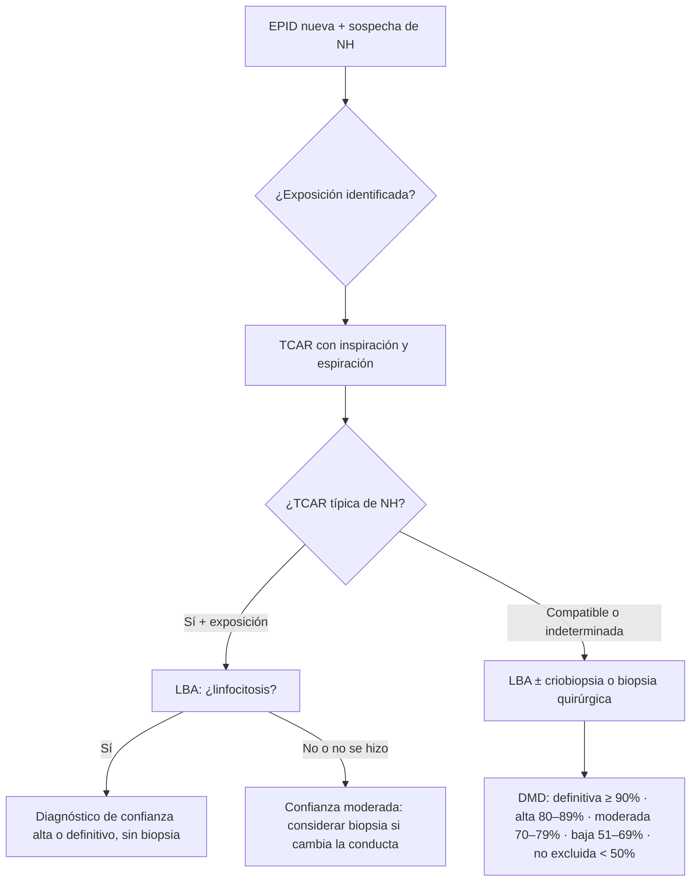

# Neumonitis por hipersensibilidad (NH)
Nota satélite de [[EPID]] · diferencial con [[Fibrosis pulmonar idiopática]] y [[Sarcoidosis]] · si progresa → [[Nintedanib]]

> [!info] Definición (ATS/JRS/ALAT 2020)
> EPID **inmunomediada** que aparece en individuos **susceptibles** tras la exposición a un agente inhalado, **identificado o no**. Compromete el parénquima y la **vía aérea pequeña** (bronquiolocéntrica).
> El nombre antiguo "alveolitis alérgica extrínseca" sigue apareciendo en libros y en mi apunte.

---

## 1. Patogenia
- **Hipersensibilidad tipo III** (complejos inmunes: IgG específicas o precipitinas, complemento). Explica la fase aguda, que aparece 4–8 h después de la exposición.
- **Hipersensibilidad tipo IV** (linfocitos Th1 y Th17, macrófagos): **granulomas pequeños mal formados**. Explica la cronicidad.
- **Huésped susceptible**: solo enferma una minoría de los expuestos. Influyen el HLA clase II y, en la NH fibrótica, el promotor de **MUC5B** y los **telómeros cortos**, igual que en la FPI.
- **El tabaco "protege"**: la nicotina inhibe la activación de macrófagos y linfocitos (↓ TNF-α, IL-12, IFN-γ). La NH es más frecuente en **no fumadores**; si un fumador la desarrolla, suele evolucionar peor y más fibrótica.
- Cofactores: infecciones virales, pesticidas.

## 2. Antígenos: preguntar por todos
| Grupo | Antígeno | Nombre clásico |
|---|---|---|
| **Aves** (el más frecuente en Latinoamérica) | Proteínas de excrementos, suero y plumas (palomas, periquitos, gallinas, loros) | **Pulmón del criador de aves**. Ojo con **palomas en el entretecho** y **almohadas o plumones de pluma** ("feather duvet lung") |
| Actinomicetos termofílicos | *Saccharopolyspora rectivirgula*, *Thermoactinomyces* (heno o grano húmedo) | **Pulmón del granjero** |
| Hongos | *Aspergillus*, *Penicillium*, *Trichosporon*, *Alternaria* | Humedad domiciliaria (relevante en Magallanes), suberosis (corcho), pulmón del quesero, trabajadores de aserradero |
| Micobacterias no tuberculosas | *M. avium complex* | **Hot tub lung** (jacuzzi, tina caliente), fluidos de metalmecánica |
| Agua contaminada | Bacterias, amebas, hongos | **Pulmón del humidificador o del aire acondicionado** |
| Químicos de bajo peso molecular | **Isocianatos** (pinturas, espumas, barnices), anhídridos | NH química |

> [!tip] Claves de la anamnesis
> - **Relación temporal**: síntomas 4–8 h después de la exposición, que mejoran los fines de semana o en vacaciones, lejos de la casa o el trabajo.
> - **Convivientes o compañeros con síntomas similares.**
> - La guía de 2020 sugiere usar un **cuestionario sistemático de exposiciones**. Aun así, en **~50% de las NH fibróticas no se identifica el antígeno**.

## 3. Clasificación
> [!warning] 🟠 Actualización: mi apunte usa aguda / subaguda / crónica
> Desde 2020 se clasifica en **NH no fibrótica** y **NH fibrótica**, según haya o no fibrosis en la TCAR o la histología. Es lo que define el **pronóstico y el tratamiento**. La clasificación temporal antigua sirve para describir la clínica:

| Rasgo | Aguda | Subaguda | Crónica |
|---|---|---|---|
| Inicio | 4–8 h post-exposición | Semanas a meses | Meses a años, insidioso |
| Fiebre, calofríos | + | − | − |
| Disnea | + | + | + progresiva |
| Tos | Seca | Productiva | Productiva o seca |
| Pérdida de peso | − | + | + |
| Crépitos | Bibasales | Difusos | Difusos, ± **graznidos** (squawks) |
| Rx | Normal o vidrio esmerilado | Nodular fino | Reticular o fibrosis |
| Función | Restrictiva | Mixta | Mixta o restrictiva |
| Corresponde hoy a | **No fibrótica** | Habitualmente no fibrótica | **Fibrótica** |

## 4. Clínica
- **No fibrótica**:
  - Episodios gripales recurrentes (fiebre, calofríos, mialgias, tos, disnea) que se resuelven en 24–48 h sin exposición.
  - O bien disnea y tos subagudas con baja de peso.
  - A menudo se diagnostica mal como neumonía, asma o virosis a repetición.
- **Fibrótica**:
  - Disnea de esfuerzo progresiva, tos, crépitos.
  - **Graznidos inspiratorios** (squawks), que indican compromiso bronquiolar y son una perla.
  - Hipocratismo menos frecuente que en FPI.
  - Puede terminar en insuficiencia respiratoria, HTP y cor pulmonale.

## 5. Estudio

### Laboratorio
- Forma aguda: leucocitosis con neutrofilia, PCR y VHS ↑.
- **IgG específicas o precipitinas**:
  - Demuestran **exposición y sensibilización, no enfermedad**. Hay expuestos sanos positivos.
  - Un resultado negativo no descarta, porque los paneles son limitados.
  - La guía de 2020 sugiere pedirlas para ayudar a identificar el antígeno.
- Descartar conectivopatía (ANA, FR, anti-CCP, panel de miositis): es el diferencial clave en la NH fibrótica.

### Función pulmonar
- Puede ser normal al inicio.
- **DLCO ↓ precoz.**
- Restrictivo; a veces obstructivo o mixto por el componente bronquiolar.
- Desaturación en PM6M.

### TCAR (criterios 2020)
| | Típico de NH |
|---|---|
| **No fibrótica** | ≥ 1 signo de **infiltración** (vidrio esmerilado, atenuación en mosaico) **+** ≥ 1 signo de **vía aérea pequeña** (**nódulos centrolobulillares** mal definidos, **atrapamiento aéreo** en espiración). Distribución difusa, a menudo con respeto relativo de las bases |
| **Fibrótica** | **Fibrosis** (reticulación con distorsión, bronquiectasias de tracción ± panal), de distribución aleatoria, **predominio medio** o respeto de las bases, **+** ≥ 1 signo de vía aérea pequeña |
| Signo más específico | **Tres densidades** ("headcheese"): lóbulos de densidad normal, vidrio esmerilado y lóbulos hipodensos con atrapamiento aéreo, todos adyacentes |

> [!note] La TC en espiración es obligatoria
> Sin espiración no se ve el atrapamiento aéreo y la NH fibrótica puede leerse como NIU o NINE. Si la TCAR muestra un patrón **"alternativo"** en la clasificación de FPI (mosaico, tres densidades, predominio superior o medio), pensar en NH.

### LBA
- **Linfocitosis**: > 30% apoya NH no fibrótica (a menudo > 50%). En la fibrótica, > 20% apoya.
- La guía de 2020 **sugiere LBA con recuento celular** en toda EPID nueva con sospecha de NH.
- 🟠 El cociente CD4/CD8 (bajo en NH según mi apunte) es **poco fiable**: varía con el tabaco y el tiempo de evolución. Ya no se usa para diagnosticar.
- Mi apunte agrega que 24 h post-exposición también suben neutrófilos, eosinófilos y basófilos. Después de 7 días quedan solo los linfocitos.

### Histología (criobiopsia transbronquial o biopsia quirúrgica)
- **No fibrótica típica** (tríada):
  1. Bronquiolitis celular.
  2. Neumonía intersticial linfocítica bronquiolocéntrica.
  3. **Granulomas no necrotizantes pequeños y mal formados**.
- **Fibrótica**: lo anterior + fibrosis bronquiolocéntrica, metaplasia peribronquiolar, patrón tipo NIU o tipo NINE.
- Frente a la sarcoidosis: en la sarcoidosis los granulomas son **grandes, bien formados** y de distribución **perilinfática**.

### Otros
- Prueba de provocación inhalatoria o de reexposición: solo en centros especializados, no de rutina.

## 6. Diagnóstico por niveles de confianza (DMD)

> [!warning] 🟠 Mi apunte: criterios de Schuyler
> Los criterios de Schuyler (4 mayores + 2 menores) son **históricos**. Hoy el diagnóstico se hace por **DMD integrando exposición + TCAR + LBA ± histología**, con niveles de confianza. Si los menciono en el examen, aclarar que están reemplazados.

## 7. Diagnóstico diferencial
| Si parece… | Distinguir por |
|---|---|
| **FPI** (NH fibrótica) | La FPI es subpleural y basal, sin signos de vía aérea pequeña ni linfocitosis. La NH tiene exposición, mosaico o atrapamiento y predominio medio o superior |
| **EPID-ETC / NINE** | Serología, síntomas sistémicos, respeto subpleural en la NINE |
| **Sarcoidosis** | Adenopatías hiliares, nódulos perilinfáticos, granulomas bien formados, CD4/CD8 > 3,5 |
| **NOC** | Consolidaciones periféricas migratorias, halo invertido |
| **Síndrome tóxico por polvo orgánico (ODTS)** | No inmunológico. Afecta a **muchos expuestos a la vez** tras una exposición masiva. TC normal, LBA **neutrofílico**, precipitinas negativas, autolimitado |
| Infección atípica, TBC, ABPA | Cultivos, eosinofilia e IgE en la ABPA |
| BR-EPID / NID | Fumador activo |
| Asma | Obstrucción reversible, sin DLCO baja |

## 8. Tratamiento
1. **Evitar el antígeno. Es el pilar y lo único que modifica la historia natural.**
   - Aves: sacarlas de la casa y **limpieza profunda**; el antígeno persiste por meses en alfombras y muebles. Revisar entretechos (palomas) y cambiar almohadas o plumones de pluma.
   - Humedad u hongos: remediación profesional, eventualmente cambio de vivienda.
   - Jacuzzi: dejar de usarlo.
   - Laboral: la mascarilla o el respirador rara vez bastan; puede requerir cambio de puesto (evaluar Ley 16.744 si es ocupacional).
2. **NH no fibrótica**:
   - Leve y que mejora al retirar la exposición: **solo evitar**. Se resuelve en semanas; según mi apunte, en > 10 semanas sin tratamiento.
   - Sintomática o grave: **prednisona 0,5 mg/kg/día (40–60 mg)** por 1–2 semanas (hasta 4), luego descenso hasta suspender en **4–6 semanas** (esquema de mi apunte). Otra pauta citada en mi apunte es 0,5–1 mg/kg por 1 mes y descenso hasta 10–15 mg/día.
3. **NH fibrótica** con progresión o compromiso relevante:
   - Prednisona 0,5 mg/kg/día por 4 semanas y descenso gradual en ~2 meses hasta mantención (≤ 10 mg).
   - **+ ahorrador de corticoides**: **MMF 1–1,5 g c/12 h** o **azatioprina 1,5–2 mg/kg/día** (medir TPMT antes). Series retrospectivas muestran mejoría de la DLCO y menos corticoides.
   - **Reevaluar a los 3–6 meses** con CVF, DLCO y PM6M. Mantener solo si hay mejoría o estabilidad objetiva (criterio de mi apunte).
4. **Si cumple criterios de FPP** (≥ 2 de 3 en 1 año: síntomas, caída de CVF ≥ 5% o DLCO ≥ 10%, progresión en TC) → **[[Nintedanib]] 150 mg c/12 h**. En INBUILD ~26% eran NH.
5. **Soporte**: O₂ si hay hipoxemia, rehabilitación, vacunas. Profilaxis de *P. jirovecii*, protección ósea y tamizaje de TBC y hepatitis si hay corticoides ≥ 20 mg + inmunosupresor.
6. **Trasplante** en enfermedad fibrótica avanzada.

> [!danger] 🔴 Qué no hacer
> - **Beclometasona inhalada** en dosis altas (mi apunte): **sin evidencia**, no se recomienda. Los broncodilatadores o corticoides inhalados solo se usan si hay obstrucción o asma asociadas.
> - Mantener corticoides crónicos en NH fibrótica **sin respuesta objetiva**: solo suman toxicidad.
> - Dar corticoides sin haber retirado la exposición.

## 9. Pronóstico
- **No fibrótica**: excelente si se retira el antígeno; puede resolverse por completo.
- **Fibrótica**: peor. Con **panal**, la sobrevida es parecida a la de la FPI.
- Predictores de mal pronóstico:
  - Fibrosis y panal en TCAR.
  - **Antígeno no identificado** o exposición mantenida.
  - Ausencia de linfocitosis en el LBA.
  - Tabaquismo.
  - Caída de CVF.
- La NH fibrótica también puede tener **exacerbaciones agudas**, con manejo similar al de la FPI.

## 10. Correcciones a mi apunte (R. Paz)
- 🟠 Aguda/subaguda/crónica → **no fibrótica / fibrótica** (2020).
- 🟠 Criterios de Schuyler → diagnóstico por **DMD con niveles de confianza**.
- 🔴 "52% de trabajadores de oficina pueden presentar pulmón del humidificador" → sin sustento; son brotes puntuales.
- 🔴 Beclometasona 2000 µg/día → sin evidencia.
- 🟠 CD4/CD8 → poco útil; importa el **% de linfocitos**.
- ✅ Se mantiene: relación temporal de 4–8 h, "protección" del tabaco, precipitinas = exposición, dosis de prednisona, tabla clínica, criterio de continuar solo si hay mejoría objetiva.

## 11. Perlas de examen
- Mujer no fumadora, con **palomas en el entretecho o loros**, disnea y tos que mejoran en vacaciones → NH.
- TCAR con **mosaico + atrapamiento aéreo + nódulos centrolobulillares** en campos medios y superiores → NH (y si hay fibrosis, patrón "alternativo" frente a la FPI).
- LBA con **linfocitosis > 30%** → NH (o sarcoidosis, NINE celular, NOC).
- **Graznidos** inspiratorios en un paciente con fibrosis → NH fibrótica.
- Precipitinas positivas **no confirman** el diagnóstico.
- El tratamiento que más importa es **retirar la exposición**. La fibrótica que progresa pese a todo recibe **nintedanib**.
- Caso de Coni: exposición a gallinas + TCAR fibrótica + síntomas de conectivopatía → diferencial **NH fibrótica vs EPID-ETC**. Suspender el contacto con aves mientras se estudia.
